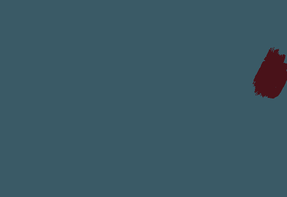
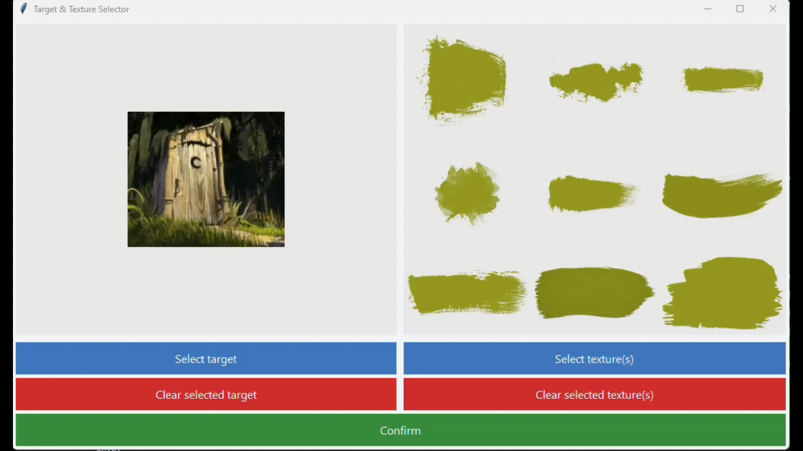

# Hill Climb Painter

A Python desktop application that recreates images into paintings


## Overview

Hill Climb Painter is an image reconstruction algorithm that transforms images and short animations into painted representations by sequentially placing textured brush strokes. 
A greedy hill-climbing algorithm is used to iteratively optimize each stroke’s position, rotation, and scale, minimizing the visual difference between the target image and the canvas.

Each brush stroke is assessed for its visual impact before being applied to the canvas, ensuring that only those contributing meaningful detail are added. As more strokes are layered, coarse and abstract forms are gradually refined into structure, resulting in a painting that blends photorealism with the textured aesthetics of impressionism.

## Features


### 🎨 Input and Output
- **Multiple Format Support**: PNG, JPG, JPEG, and animated GIF inputs
- **High-Resolution Output**: Specify a desired resolution of the final painting (up to 4K)
- **Texture-Based Painting**: Use custom PNG textures such as brush strokes or shapes

### ⏰ Real-Time Visualization
- **Live Painting Display**: Watch the algorithm work in real-time in a pygame display
- **Progress Tracking**: Visualize improvements of texture placements during optimisation process
- **Painting Progress GIFs**: Save time-lapse animations of painting progress

### ⚙️ GUI for parameter customization
- **Persistent settings**: Selected target, texture and parameters are automatically saved
- **Hill Climbing Settings**: Extensive customization for hill climbing parameters
- **Vector Field Equations**: Align textures to a mathematically defined vector field


### ⚡ Performance optimisation
- **Numba Acceleration**: JIT compilation for expensive functions
- **Multiprocessing Support**: Paint multiple GIF frames in parallel


## Installation and setup
### Prerequisites
- Python 3.7 or higher
- Virtual environment (recommended)

### Step 1: Clone the Repository
```bash
git clone https://github.com/johnleejunhan12/hill-climb-painter.git
cd hill-climb-painter
```

### Step 2: Create Virtual Environment
```bash
# Windows
python -m venv venv
venv\Scripts\activate

# macOS/Linux
python3 -m venv venv
source venv/bin/activate
```

### Step 3: Install Dependencies
```bash
pip install -r requirements.txt
```
- **numpy**: Numerical computing for image arrays
- **matplotlib**: Plotting and final image display
- **Pillow**: Image processing (PNG/JPEG/GIF handling)
- **numba**: JIT compilation for performance
- **pygame**: Real-time painting progress display
- **imageio**: GIF creation from frames
- **sympy**: Vector field equation parsing


## Usage
### Step 1: Run the application
```bash
python main.py
```
### Step 2: Select target and textures
* Choose a target image to paint (PNG, JPG, JPEG)
* Choose textures (PNG)


### Step 3: Adjust parameters

Experiment with various parameters to achieve your desired style of painting


<details>

<summary>GUI guide</summary>

| #  | **Parameters**                          | **Effect**                                                                                             |
|----|---------------------------------------------|--------------------------------------------------------------------------------------------------------|
| 1  | Computation size                            | Sets the computation canvas resolution. Decrease for speed, increase to capture greater detail. |
| 2  | Add N textures                              | More textures result in a more detailed painting.                                                      |
| 3  | Number of hill climb iterations             | Optimization steps per texture. Higher value leads to better texture placement, but runs slower.                         |
| 4  | Texture opacity                             | Opacity of each texture. *100% = fully opaque; lower = more translucent.*                              |
| 5  | Initial texture size                        | Specify length of texture's shorter side when it is initially generated                                         |
| 6  | Constrain texture size to initial size      | If checked, texture size remain unchanged during hill climb optimisation                                                 |
| 7  | Display painting progress                   | Shows the painting progress in real time                                                             |
| 7a | Show improvement of individual textures      | Show optimisation process of texture placement                                          |
| 7b | Display final image after painting          | Shows the completed painting after all textures are applied.                                           |
| 8  | Allow early termination of hill climbing    | Optimisation of texture placements stop if no improvement occurs after N iterations.                                 |
| 9  | Enable vector field                         | Enforces a contstraint on texture rotation, aligning them to a specified vector field                          |


<br>

| #  | **Output Settings**                     | **Effect**                                                                                               |
|----|---------------------------------------------|----------------------------------------------------------------------------------------------------------|
| 1  | Output image size                           | Resolution of final painted image. *(High-res output possible even with a low-res computation canvas)*   |
| 2  | Name of output image                        | Specify a name of the painted image                                                                      |
| 3  | Create GIF of painting progress             | If checked, generates a GIF showing the painting process.                                                |
| 3a | Enter GIF filename                          | Filename of painting progress GIF.                                                                       |

</details>


### Step 4: View the painting process
If **display painting progress** was enabled, you can watch the algorithm paint in real time in a display. The pygame window can be closed to prematurely stop the painting process.

https://github.com/user-attachments/assets/db229c0f-234f-4ed7-b74b-e8ecd0e8e5f7


### Step 5: Obtain result from output folder
All painted results are saved to `hill-climb-painter\output`

<p float="left">
  
   
</p>


## Animated inputs

GIFs can be recreated into painted versions too.

For faster results, you can enable multiprocessing to paint multiple frames in parallel

<p float="left">
  
   
   
</p>


## Creative constraints


### 1) Different textures
The textures used are not limited to just brushstrokes. We can use various shapes such as circles, triangles and squares as the texture. We can also use unusual textures such as lines to produce a chaotic and scribbly abstract rendition of the original image.

### 2) Disable scaling of texture
By setting an initial texture size and restricting it, we can achieve painting styles like pointillism, where small textures are applied in patterns to form an image.


### 3) Vector fields

Vector fields `(f(x,y), g(x,y))` allow us to control texture directionality by constraining brush strokes to align with the field's flow. To demonstrate this, we create a radial sink pattern using the vector field `(-x, -y)`, which causes textures to converge toward a central point. By positioning this convergence point at the cat's nose `(267, 279)`, all brush strokes naturally flow inward, creating a focal point that draws the viewer's attention. 


### 2) Prevent resizing of textures

### 3) 


## How it works
To generate a painted approximation of a target image using textures, we begin by initializing a blank canvas with the average RGB color of the target image. In this example, we will use 11 different paintstrokes as textures. 

<br><br>
Initially, a random paint stroke is selected. It is assigned a random scale, position, and rotation. As seen in the image below, its color is computed by taking the average of the RGB values within the corresponding region of the target.

<br><br>
Next, we need to determine whether the placement of a paint stroke is "good" or "bad".
To achieve this, we define a quantitative scoring system that satisfies the following requirements:

#### **Reward Good Placements** (Higher Score):  
- **Detail Addition:** Fills empty/blurry regions, improving canvas similarity with the target.  
- **Color Suitability:** Matches the target region's average color (best in low-variance areas).  
- **Coverage:** Maximizes area filled without overwriting existing details.  

#### **Penalize Bad Placements** (Lower Score):  
- **Destructive Changes:** Reduces similarity to the target.  
- **Overwriting Details:** Damages already accurate regions.  
- **Inefficiency:** Tiny strokes in sparse areas (prefer larger strokes for better coverage). 


<!-- #### **Reward good placements that**:
- **Add more detail** to empty or blurry regions of the canvas, bringing it closer to the target image by filling in underdeveloped areas.
- **Use a suitable color** that closely resembles the corresponding region in the target image. This ensures the paint stroke blends naturally into the canvas.  
  > *Note:* Since the stroke's color is calculated using the average RGB values of the region it would cover, the most suitable colors occur when the target region has low color variance. The painted result will look more cohesive if strokes are placed in areas of consistent color rather than highly varied regions.
- **Maximize coverage** by filling in large areas of empty or blurry canvas without overwriting existing details.


#### Penalize bad placements that:
- **Make the canvas worse** by reducing its similarity to the target image. Such strokes are destructive and lead to a sloppier final result.
- **Overwrite already detailed or accurate areas**, which can undo valuable work already done in previous strokes.
- **Contribute little to no meaningful detail**. For example, placing tiny strokes in nearly empty areas. In such cases, using larger strokes would be more effective and should be encouraged. -->


### Calculating the scoring heuristic:


**1) Finding the error between the target image and canvas**

Pixel errors are calculated using root sum of squared difference between RGB values of the target and canvas.

<br><br>

**2) Finding the error between the target image and canvas with paint stroke**

We calculate pixel errors again using the same formula but with the texture drawn onto the canvas

<br><br>

**3) Obtain the difference between errors**

The final score is calculated by taking the difference in errors before and after the texture was added. As seen in the color map plot, textures that are well placed receive a higher score as they reduce the total pixel error between the canvas and target image.

<br><br>
#### **Penalizing sub-optimal placements**
If the texture was placed in a suboptimal configuration, it will be penalized as shown in the red (negative) regions of the scoring color plot.


### Greedy Hill Climbing

After an initial score is obtained, the texture undergoes random perturbations to its position, rotation, and scale. After each adjustment, the score is recalculated. If the new configuration yields a higher score, it is accepted; otherwise, the previous configuration is retained. 


This iterative process continues until an iteration limit is reached or terminates after a specified number of failed iterations without further improvement. 


### Painting the image
By repeatedly applying the same optimization technique across several hundred strokes, we gradually build up the image, layer by layer, until a coherent painting emerges. The GIF below illustrates the overall painting process where each stroke's position, scale, and rotation are optimized using greedy hill climbing before being committed to the canvas.


## Optimizations

### Performance Tuning
- **Computation Size**: 50-200 for testing, 300-600 for final output
- **Texture Count**: 100-500 for speed, 1000-5000 for quality
- **Multiprocessing**: Enable for GIFs with 10+ frames

### Quality Settings
- **High Quality**: Large computation size, many textures, high iterations
- **Fast Preview**: Small computation size, few textures, low iterations
- **Balanced**: Medium settings with early termination enabled

### Memory Considerations
- Large GIFs may require significant RAM
- Enable multiprocessing to distribute load
- Consider reducing frame count for very long animations

## Lessons learnt

## Inspiration


## Gallery

Here are some paintings that are genertated by Hill Climb Painter


---


