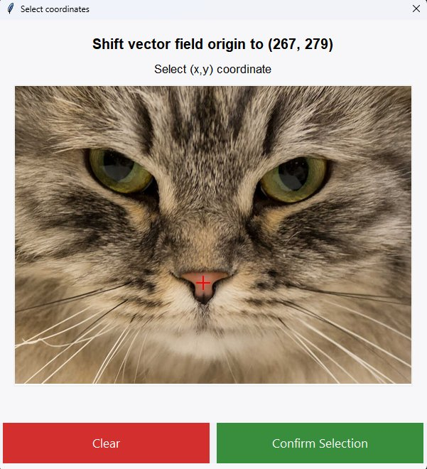

# Hill Climb Painter

A Python desktop application that recreates images into paintings


## Overview

Hill Climb Painter is an image reconstruction algorithm that converts images and short animations into painted versions by sequentially placing textured brush strokes. It uses a greedy hill-climbing algorithm to optimize the position, rotation, and scale of each stroke to reduce the visual difference between the target image and the canvas. 

Each brush stroke is assessed for its visual impact before being applied to the canvas, ensuring that only those contributing meaningful detail are added. As more strokes are layered, coarse and abstract forms are gradually refined into structure, creating a photorealistic painting with the textured aesthetics of impressionism.


## Features


### Input and Output
- **Multiple Format Input**: PNG, JPG, JPEG, and animated GIF inputs
- **High-Resolution Output**: Specify a desired resolution of the final painting (up to 4K)
- **Texture-Based Painting**: Use custom PNG textures such as brush strokes or shapes

### Real-Time Visualization
- **Live Painting Display**: Watch the algorithm work in real-time in a pygame display
- **Progress Tracking**: Visualize improvements of texture placements during optimisation process
- **Painting Progress GIFs**: Save time-lapse animations of painting progress

### GUI for parameter customization
- **Persistent settings**: Selected target, texture and parameters are automatically saved
- **Hill Climb Settings**: Extensive customization of hill climbing parameters
- **Vector Field Pattern**: Align textures to a mathematically defined vector field


## Installation and setup
### Prerequisites
- Python 3.7 or higher
- Virtual environment (recommended)

### Step 1: Clone the Repository
```bash
git clone https://github.com/johnleejunhan12/hill-climb-painter.git
cd hill-climb-painter
```

### Step 2: Create Virtual Environment
```bash
# Windows
python -m venv venv
venv\Scripts\activate

# macOS/Linux
python3 -m venv venv
source venv/bin/activate
```

### Step 3: Install Dependencies
```bash
pip install -r requirements.txt
```

<details>
<summary>Dependencies</summary>

- **numpy**: Numerical computing for image arrays
- **matplotlib**: Plotting and final image display
- **Pillow**: Image processing (PNG/JPEG/GIF handling)
- **numba**: JIT compilation for performance
- **pygame**: Real-time painting progress display
- **imageio**: GIF creation from frames
- **sympy**: Vector field equation parsing
</details>
<br>

## Usage
### Step 1: Run the application
```bash
python main.py
```
### Step 2: Select target and textures
* Choose a target image to paint (PNG, JPG, JPEG)
* Choose textures (PNG)


### Step 3: Adjust parameters

Experiment with various parameters to achieve your desired style of painting


<details>

<summary>Parameter guide</summary>

| #  | **Parameters**                          | **Effect**                                                                                             |
|----|---------------------------------------------|--------------------------------------------------------------------------------------------------------|
| 1  | Computation size                            | Sets the computation canvas resolution. Decrease for speed, increase to capture greater detail. |
| 2  | Add N textures                              | More textures result in a more detailed painting.                                                      |
| 3  | Number of hill climb iterations             | Optimization steps per texture. Higher value leads to better texture placement, but runs slower.                         |
| 4  | Texture opacity                             | Opacity of each texture. *100% = fully opaque; lower = more translucent.*                              |
| 5  | Initial texture size                        | Specify length of texture's shorter side when it is initially generated                                         |
| 6  | Constrain texture size to initial size      | If checked, texture size remain unchanged during hill climb optimisation                                                 |
| 7  | Display painting progress                   | Shows the painting progress in real time                                                             |
| 7a | Show improvement of individual textures      | Show optimisation process of texture placement                                          |
| 7b | Display final image after painting          | Shows the completed painting after all textures are applied.                                           |
| 8  | Allow early termination of hill climbing    | Optimisation of texture placements stop if no improvement occurs after N iterations.                                 |
| 9  | Enable vector field                         | Enforces a contstraint on texture rotation, aligning them to a specified vector field                          |


<br>

| #  | **Output Settings**                     | **Effect**                                                                                               |
|----|---------------------------------------------|----------------------------------------------------------------------------------------------------------|
| 1  | Output image size                           | Resolution of final painted image. *(High-res output possible even with a low-res computation canvas)*   |
| 2  | Name of output image                        | Specify a name of the painted image                                                                      |
| 3  | Create GIF of painting progress             | If checked, generates a GIF showing the painting process.                                                |
| 3a | Enter GIF filename                          | Filename of painting progress GIF.                                                                       |

</details>


### Step 4: View the painting process
If **display painting progress** was enabled, you can watch the algorithm paint in real time in a display. 

The pygame window can be closed to prematurely stop the painting process.

https://github.com/user-attachments/assets/db229c0f-234f-4ed7-b74b-e8ecd0e8e5f7


### Step 5: Output
After the painting is completed, you can obtain the results from `hill-climb-painter\output`

<p float="left">
  
   
</p>


## Animated inputs
You can obtain a painted version of an input GIF too

<p float="left">
  
   
</p>


## Influential parameters

### 1) Number of textures

Depending on how many textures are added to the cavas, you can obtain a painting with a desired level of detail. The following example demonstrates a painting of a cat, created from increasing number of textures.

| 100 | 200 | 300 | 400 |
|:---:|:---:|:---:|:---:|
|  |  |  |  |

| 500 | 1000 | 2000 | 5000 |
|:---:|:---:|:---:|:---:|
|  |  |  |  |


### 2) Number of hill climbing steps

Given a fixed number of textures, the quality of their placement can be significantly affected by the number of optimization steps used. In this application, the number of optimization steps increases linearly from `min_iterations` to `max_iterations`. In this example, 400 textures are applied with varying numbers of hill climbing steps. The painting with fewer optimization steps appears messier and more chaotic, while the one with more steps results in a cleaner and more structured composition. Finer strokes generally benefit from more precise placement to improve the overall coherence of the painting. 

| 1–50 steps | 50–200 steps | 500–1000 steps |
|:----:|:------:|:--------:|
|  |  |  |

### 3) Computational canvas size
*(Not to be confused with the output canvas size)*

To generate a highly realistic and detailed painting, thousands of textures may be applied. However, as the level of detail increases, the canvas resolution eventually becomes the limiting factor, no matter how many textures are used. Typically, a canvas size of 200-300 pixels strikes a good balance between computational speed and visual quality. For finer detail, you can increase the canvas size, though this will result in longer processing times.

The example below compares two paintings, each generated with 10,000 textures and identical parameter settings, except for the computational canvas size. Despite having the same output resolution, the painting 
created on a 300px canvas appears significantly more detailed than the other one created on a 100px canvas, demonstrating the impact of computational resolution on final quality.


| 100px | 300px |
|:-----:|:-----:|
|  |  |


## Setting creative constraints


### 1) Texture Types
Aside from paint strokes, you can use various textures to create different styles of paintings.


**Traingles, squares and circles**
<p float="left">
  
   
   
</p>


**Long lines**
<p float="left">
   
   
  
</p>


### 2) Disable texture scaling
By specifying and fixing a small texture size, you can create a distinctive painting style where all textures are uniformly sized. In this example, 10,000 circles are used, each constrained to 13 pixels. Given the canvas resolution of 317 pixels, the relatively small texture size results in a composition made entirely of tiny, dot-like elements.
<p float="left">
   
   
</p>


### 3) Vector fields

Vector fields `(f(x,y), g(x,y))` allow us to control texture directionality by forcing their rotation to align with the field's flow. 

Here we create a radial sink pattern using the vector field `(-x, -y)`, which converges at `(0,0)`. By translating the field's origin to `(267, 279)`, we can strategically align all textures to face a point of interest.
<p float="center">
  
   
   
</p>


Vector field constraints can be set for GIF inputs too


<p float="center">
   
  
   
</p>


## How it works
To generate a painted approximation of a target image using textures, we begin by initializing a blank canvas with the average RGB color of the target image. In this example, we will use 11 different paintstrokes as textures. 

<br><br>
Initially, a random paint stroke is selected. It is assigned a random scale, position, and rotation. As seen in the image below, its color is computed by taking the average of the RGB values within the corresponding region of the target.

<br><br>
Next, we need to determine whether the placement of a paint stroke is "good" or "bad".
To achieve this, we define a quantitative scoring system that satisfies the following requirements:

#### **Reward Good Placements** (Higher Score):  
- **Detail Addition:** Fills empty/blurry regions, improving canvas similarity with the target.  
- **Color Suitability:** Matches the target region's average color (best in low-variance areas).  
- **Coverage:** Maximizes area filled without overwriting existing details.  

#### **Penalize Bad Placements** (Lower Score):  
- **Destructive Changes:** Reduces similarity to the target.  
- **Overwriting Details:** Damages already accurate regions.  
- **Inefficiency:** Tiny strokes in sparse areas (prefer larger strokes for better coverage). 


The intuition behind the scoring system is to determine whether a paint stroke reduces the visual error between the target image and the current canvas. To implement this, we can compare the error before and after applying the stroke. The greater the reduction in error, the better the score, which is an indicator of the goodness of fit of the texture on the canvas.

### Calculating the scoring heuristic:


**1) Finding the error between the target image and canvas**

Pixel errors are calculated using root sum of squared difference between RGB values of the target and canvas.

<br><br>

**2) Finding the error between the target image and canvas with paint stroke**

We calculate pixel errors again using the same formula but with the texture drawn onto the canvas

<br><br>

**3) Obtain the difference between errors**

The final score is calculated by taking the difference in errors before and after the texture was added. As seen in the color map plot, textures that are well placed receive a higher score as they reduce the total pixel error between the canvas and target image.

<br><br>
#### **Penalizing sub-optimal placements**
If the texture was placed in a suboptimal configuration, it will be penalized as shown in the red (negative) regions of the scoring color plot.


### Greedy Hill Climbing

After an initial score is obtained, the texture undergoes random perturbations to its position, rotation, and scale. After each adjustment, the score is recalculated. If the new configuration yields a higher score, it is accepted; otherwise, the previous configuration is retained. 


This iterative process continues until an iteration limit is reached or terminates after a specified number of failed iterations without further improvement. 


### Painting the image
By repeatedly applying the same optimization technique across several hundred strokes, we gradually build up the image, layer by layer, until a coherent painting emerges. The GIF below illustrates the overall painting process where each stroke's position, scale, and rotation are optimized using greedy hill climbing before being committed to the canvas.

<p float="center">
   
  
</p>


## Optimizations Implemented

### Numba Acceleration
The painting algorithm would not be feasible in pure Python due to its performance limitations. As an interpreted language, Python is significantly slower for numerical operations and array processing. By leveraging a just-in-time (JIT) compiler like Numba, Python functions can be compiled into optimized machine code at runtime, delivering near-C performance. This dramatically speeds up critical components such as scoring and rasterization.

### Efficient Scoring and Rasterization
Rather than comparing the entire canvas to the target image for each stroke, the scoring function calculates the per-pixel contribution of a stroke directly. This avoids unnecessary computation, which is especially important when placing small textures on a large canvas, where full-image comparisons would be too slow.

A scanline rasterization algorithm is used to identify which pixels are actually affected by the texture. This means operations are only applied to non-transparent regions, improving efficiency by skipping unnecessary calculations over fully transparent areas.

### Optimized for CPU
This application is fully capable of running on a slow laptop. It takes advantage of multiprocessing to ensure that painting performance is not bottlenecked by tasks such as exporting GIF frames or updating the painting progress window.

## Inspiration
This project was inspired by [Primitive](https://github.com/fogleman/primitive), a fantastic project by Michael Fogleman that uses hill climbing to recreate images using geometric shapes. My goal was to generalize this technique to support arbitrary textures rather than just primitives, while also providing a UI for selecting textures and target images.

I was also influenced by [Spu7Nix](https://www.youtube.com/watch?v=6aXx6RA1IK4), who explored a similar idea in the video *Generating Videos in Geometry Dash with Evolution*. His insights on texture scoring helped guide my approach to evaluating brush strokes effectively.


## Final Thoughts
Building this project was a lot of fun. I created a few smaller test repositories along the way to try out different strategies before settling on the current design.

One limitation of the current implementation is that texture placements often get stuck in local minima, resulting in suboptimal stroke positioning. A potential improvement would be to sample several random positions before committing to a hill climbing run. This could help identify better starting points, leading to higher-quality placements and faster convergence.

While the codebase has grown messy and is admittedly hard to maintain, I’m still satisfied with the result. It accomplished what I set out to do: Generate painted art algorithmically for free without relying on large language models.


## Gallery

Here are some paintings that are genertated by Hill Climb Painter


<!--  -->

---


